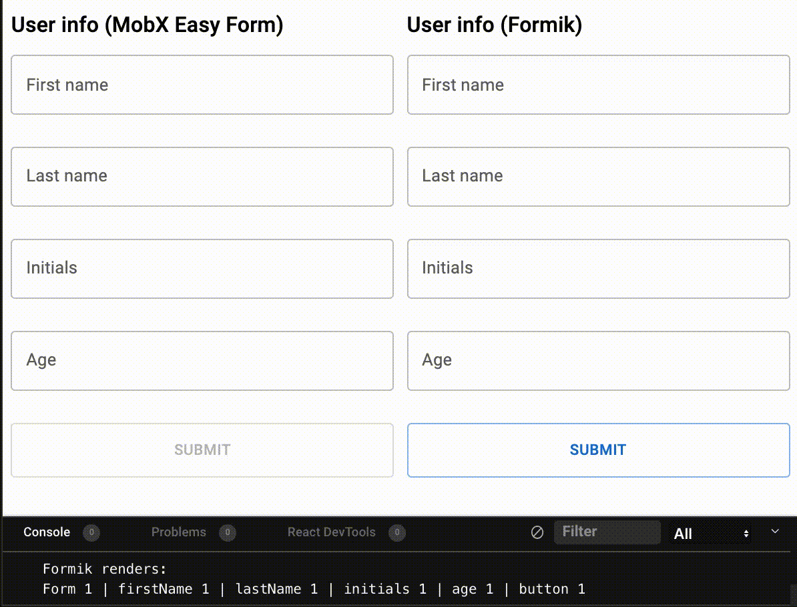

# MobX Easy Form


Simple and performant form library built with MobX.

Works with React, React Native and any other framework that supports MobX.

## Motivation

This library is heavily inspired by [Formik](https://github.com/formium/formik). I like Formik, but there are some issues with Formik that MobX Easy Form solves.

### 1. Performace

Forms can get very complicated. Formik can get slow as the form grows as it re-renders the whole form on every keystroke. There are available optimizations but it's complex to setup and can introduce bugs like a field not rendering when it should.

MobX Easy Form solves this issue with MobX. It makes sure to re-render only the components that need to re-render.

You can see the difference in the following GIF. The number of times each component renders is shown below.

<p align="center">

</p>

### 2. Validation limitations

Formik forces you to define the `validationScheme` and `initialValues` for all your fields at the same time, which means you can't change the validation logic based on the value of some field.

With MobX Easy Form you define each field separately so you can use one field value to initialize another.

## Installation

### Installing the dependencies

MobX Easy Form depends on `mobx`, and if you're using React, you'll also need `mobx-react-lite` (or `mobx-react` if you support class components). To install these, run

```bash
npm install mobx mobx-react-lite

# if you use yarn
yarn add mobx mobx-react-lite
```

### Installing MobX Easy Form

```bash
npm install mobx-easy-form

# if you use yarn
yarn add mobx-easy-form
```

## Quick start with React

```tsx
import { useForm, useField } from "mobx-easy-form";
import { Observer, observer } from "mobx-react";
import * as yup from "yup";

export default observer(function Form() {
  const form = useForm({
    onSubmit({ values }) {
      console.log("Values:", values);
    },
  });

  const firstName = useField({
    id: "firstName",
    form,
    initialValue: "",
  });

  const lastName = useField({
    id: "lastName",
    form,
    initialValue: "",
  });

  const initials = useField({
    id: "initials",
    form,
    initialValue: "",
    validate(initials) {
      if (
        initials.length === 2 &&
        initials[0] === firstName.state.value?.[0] &&
        initials[1] === lastName.state.value?.[0]
      ) {
        return { error: undefined, parsed: initials };
      }

      return { error: "Wrong initials", parsed: undefined };
    },
  });

  const age = useField<string, number>({
    id: "age",
    form,
    initialValue: "",
    validationSchema: yup.number(),
  });

  return (
    <div>
      <h1>User info</h1>

      <Observer>
        {() => {
          return (
            <div>
              <div>First name</div>
              <input
                value={firstName.state.value}
                onChange={(e) => firstName.actions.onChange(e.target.value)}
                onFocus={() => firstName.actions.onFocus()}
                onBlur={() => firstName.actions.onBlur()}
              ></input>
              <div>{firstName.computed.ifWasEverBlurredThenError}</div>
            </div>
          );
        }}
      </Observer>

      <Observer>
        {() => {
          return (
            <div>
              <div>Last name</div>
              <input
                value={lastName.state.value}
                onChange={(e) => lastName.actions.onChange(e.target.value)}
                onFocus={() => lastName.actions.onFocus()}
                onBlur={() => lastName.actions.onBlur()}
              ></input>
              <div>{lastName.computed.ifWasEverBlurredThenError}</div>
            </div>
          );
        }}
      </Observer>

      <Observer>
        {() => {
          return (
            <div>
              <div>Initials</div>
              <input
                value={initials.state.value}
                onChange={(e) => initials.actions.onChange(e.target.value)}
                onFocus={() => initials.actions.onFocus()}
                onBlur={() => initials.actions.onBlur()}
              ></input>
              <div>{initials.computed.ifWasEverBlurredThenError}</div>
            </div>
          );
        }}
      </Observer>

      <Observer>
        {() => {
          return (
            <div>
              <div>Age</div>
              <input
                value={age.state.value}
                onChange={(e) => age.actions.onChange(e.target.value)}
                onFocus={() => age.actions.onFocus()}
                onBlur={() => age.actions.onBlur()}
              ></input>
              <div>{age.computed.ifWasEverBlurredThenError}</div>
            </div>
          );
        }}
      </Observer>

      <Observer>
        {() => {
          return (
            <button
              onClick={form.actions.submit}
              disabled={form.computed.isError && form.state.submitCount > 0}
            >
              SUBMIT ({form.computed.isError ? "invalid" : "valid"})
            </button>
          );
        }}
      </Observer>
    </div>
  );
});
```

## React Example on CodeSandbox

### [https://codesandbox.io/s/mobx-easy-form-example-xn3ss](https://codesandbox.io/s/mobx-easy-form-example-xn3ss)

## React Native Example on Expo Snack

### [https://snack.expo.dev/@hrastnik/react-native---mobx-easy-form](https://snack.expo.dev/@hrastnik/react-native---mobx-easy-form)

## Getting started

Create a form and define the `onSubmit` function.

```ts
const from = useForm({
  async onSubmit({ values }) {
    console.log(values);
  },
});
```

Create some fields, and add them to the form by passing the created `form` to the `useField` parameter `form`. We also need an `id` and `initialValue`

```ts
const firstName = useField({
  id: "firstName",
  form,
  initialValue: "",
});
```

The `id` is used to access the field when through the `form` object.

```ts
form.fields.firstName === firstName; // true
```

You can pass a validation function to `useField` but MobX Easy Form works really well with [yup validation library](https://github.com/jquense/yup) and it's the recommended approach.

```ts
const age = useField<string, number>({
  id: "age",
  form,
  initialValue: "",
  validationSchema: yup
    .number()
    .typeError("Age should be a number")
    .required("Age is required"),
});
```

Note that we're using TypeScript here and we're passing 2 types to the `useField` generic. The first type is the type of the input value (the value passed to `initialValue`) and the second type is the output type that our validation function parses. For example, if you have a text input used to enter age, the input type would be string since it's a text input, and the output type would be number since the `validationSchema` would parse it to a number.

MobX Easy Form uses the validation function for two things:

1. To check if the value is in the right format.
2. To parse the value and convert it to something usable.

In the example above, the field state will hold the string value of a number - e.g. `"42"`, but yup will convert it to a number `42` that we can access through `age.computed.parsed` and is also the value we get in the `onSubmit({ values })`

### IMPORTANT!

> The `useForm` and `useField` are React hooks that use `createForm` and `createField` and cache the result so that React doesn't re-create the form on each render. In other words `useForm` and `useField` make sure the form and fields only get created once. If you want to re-create the fields you can pass a dependency array as the second parameter to `useForm` and `useFields`.

## Render

We can now render the inputs. A great performance optimization is to use the `<Observer>` component from `mobx-react` to limit the renders to only the input that needs to change. Alternatively you can create your own input component with the `observer` HOC.

Each field has the `state`,`computed` and `actions` props.

```tsx
<Observer>
  {() => {
    return (
      <div>
        <div>First name</div>
        <input
          value={firstName.state.value}
          onChange={(e) => firstName.actions.onChange(e.target.value)}
          onFocus={() => firstName.actions.onFocus()}
          onBlur={() => firstName.actions.onBlur()}
        ></input>
        <div>{firstName.computed.ifWasEverBlurredThenError}</div>
      </div>
    );
  }}
</Observer>
```

## API

### `useForm` / `createForm`

| parameter  | type                         | required | description                                                                              |
| ---------- | ---------------------------- | -------- | ---------------------------------------------------------------------------------------- |
| `onSubmit` | (props: OnSubmitArg) => any; | true     | Function that will be ran when `form.actions.submitForm` is called if the form is valid. |

Returns a `Form` instance.

### `OnSubmitArg`

| parameter   | type                   | description                                                                                                                                         |
| ----------- | ---------------------- | --------------------------------------------------------------------------------------------------------------------------------------------------- |
| `fields`    | Record<string, Field>; | An object containing all the fields added to the form. Key's are `id`s passed to the `createField` prop.                                            |
| `rawValues` | Record<string, any>;   | An object containing all the raw values from all the fields in the form.                                                                            |
| `values`    | Record<string, any>;   | An object containing all the parsed values (returned from the `validate` or validated using the validation schema) from all the fields in the form. |

### `useField` / `createField`

| parameter          | type                                                                                        | required | description                                                                                                                                                                                                                                                       |
| ------------------ | ------------------------------------------------------------------------------------------- | -------- | ----------------------------------------------------------------------------------------------------------------------------------------------------------------------------------------------------------------------------------------------------------------- |
| `id`               | string                                                                                      | required | Unique identifier for the given field. When you add the field to a `form`, you can later access the field in `form.fields.<id>`                                                                                                                                   |
| `initialValue`     | any                                                                                         | required | The initial value of the field. If you're using TypeScript, note that this field will be used to type the values you can set through `onChange`, so for optional fields consider using a cast to add the `undefined` type. (`initalValue: "" as "" \| undefined`) |
| `form`             | Form (return value of `createForm`)                                                         | required | The form to which the newly created field should be added.                                                                                                                                                                                                        |
| `validationSchema` | Yup.ValidationSchema                                                                        | optional | [Yup validation schema](https://github.com/jquense/yup) used to validate the field value. You can only set one of `validationSchema` and `validate`                                                                                                               |
| `validate`         | (value: any) => { error?: undefined, parsed: any } \| { error: string, parsed?: undefined } | optional | Validation function used to validate and parse the value. It receives the value and must return and object with either `error` or `parsed` set                                                                                                                    |
| `initialError`     | string                                                                                      | optional | Initial error for the field                                                                                                                                                                                                                                       |

Returns a `Field` instance

### `Field`

| parameter                            | type                          | description                                                                                            |
| ------------------------------------ | ----------------------------- | ------------------------------------------------------------------------------------------------------ |
| `state.errorOverride`                | string \| undefined           | Custom error message set on the field                                                                  |
| `state.id`                           | string                        | `id` of the field                                                                                      |
| `state.isFocused`                    | boolean                       | `true` if the field is focused, `false` otherwise                                                      |
| `state.value`                        | any                           | Current value of the field                                                                             |
| `state.wasEverBlurred`               | string                        | `true` if the field was ever blurred, `false` otherwise                                                |
| `state.wasEverFocused`               | string                        | `true` if the field was ever focused, `false` otherwise                                                |
| `computed.error`                     | string \| undefined           | Custom error message set on the field                                                                  |
| `computed.ifWasEverBlurredThenError` | string \| undefined           | if the field was ever blurred returns the value of `computed.error`, otherwise returns `undefined`     |
| `computed.ifWasEverFocusedThenError` | string \| undefined           | if the field was ever focused returns the value of `computed.error`, otherwise returns `undefined`     |
| `computed.isDirty`                   | boolean                       | `true` if value is different from `initialValue`, `false` otherwise                                    |
| `computed.parsed`                    | any                           | Parsed value of the field. The parsed value returned by `validate` or cast using the validation schema |
| `actions.onBlur`                     | () => void                    | Sets `state.isFocused` to false. Should be passed to text inputs `onBlur`                              |
| `actions.onChange`                   | (value: any) => void          | Sets `state.value` to the provided value. Additionally, it clears the errorOverride if it was set      |
| `actions.onFocus`                    | () => void                    | Sets `state.isFocused` to true. Should be passed to text inputs `onFocus`                              |
| `actions.setError`                   | (string \| undefined) => void | Sets `state.errorOverride` to the provided value                                                       |

### `Form`

| parameter                           | type                    | description                                                                                                                                                                                                     |
| ----------------------------------- | ----------------------- | --------------------------------------------------------------------------------------------------------------------------------------------------------------------------------------------------------------- |
| `state.isSubmitting`                | boolean                 | `true` if the form is submitting, when the `onSubmit` function is async                                                                                                                                         |
| `state.submitCount`                 | number                  | Number of times the form was submitted                                                                                                                                                                          |
| `state.valuesAtLastSubmit`          | string \| undefined     | Used internally. You shouldn't use this                                                                                                                                                                         |
| `computed.errorList`                | [string \| undefined]   | An array of errors for all the fields                                                                                                                                                                           |
| `computed.isChangedSinceLastSubmit` | boolean                 | `true` if any field has changed since last submit, `false` otherwise                                                                                                                                            |
| `computed.isDirty`                  | boolean                 | `true` if any field is dirty (value different from initialValue)                                                                                                                                                |
| `computed.isError`                  | boolean                 | `true` if any field has `error` different from `undefined`                                                                                                                                                      |
| `computed.isValid`                  | boolean                 | `true` if `isError` is `false`, `false` otherwise                                                                                                                                                               |
| `computed.valueList`                | any[]                   | An array of all the values. Used internally, you shouldn't use this.                                                                                                                                            |
| `actions.add`                       | (field: Field) => void  | Adds the provided field to the form                                                                                                                                                                             |
| `actions.submit`                    | (value: any) => Promise | Sets `isSubmitting` to true, increases `submitCount`, for each field, sets the `wasEverFocused` and `wasEverBlurred` to `true`. Then, if `isError` is true does nothing, otherwise runs the `onSubmit` function |
